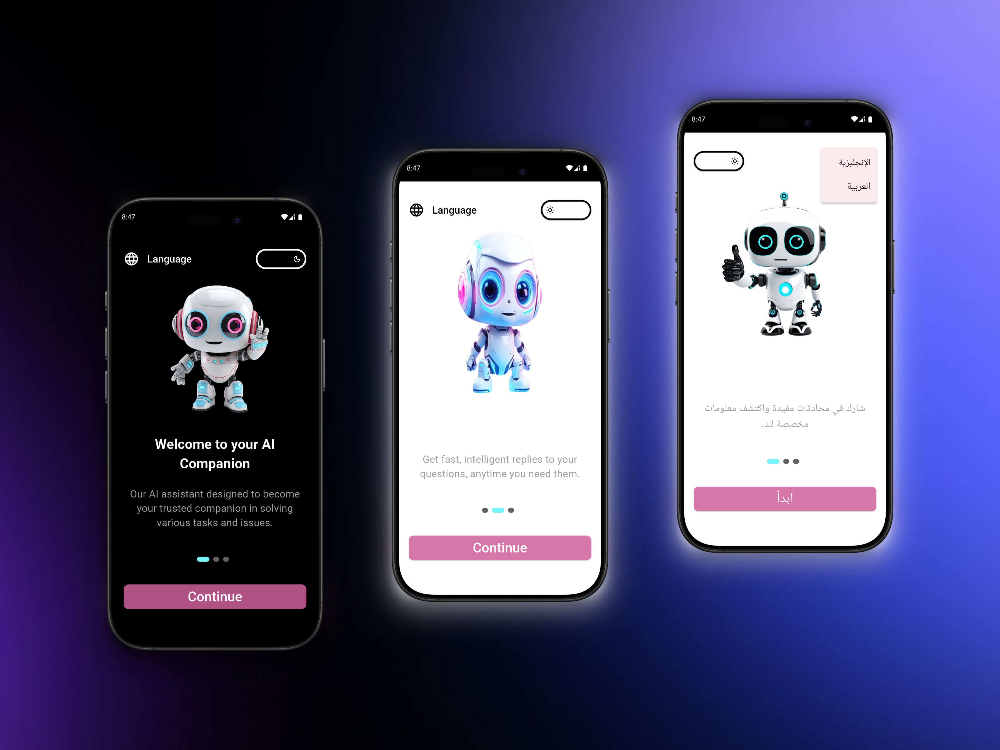

# 🤖 **Chatbot App**




> **Chatbot App** allows you to interact with **Gemini** AI, providing intelligent responses to your queries. The app also features both **Light** and **Dark modes**, as well as support for multiple languages, including **Arabic** and **English**.  
> The app supports **Sign In**, **Sign Up**, and **Password Reset** functionality, along with **Google** and **Facebook Sign-In** options.  
> Additionally, the app includes a beautiful **Onboarding experience** for first-time users.

---

## ✨ **Features**
- Chat with **Gemini** AI and receive intelligent responses.
- **Light Mode** and **Dark Mode** support for user preference.
- Supports multiple languages: **Arabic** and **English**.
- **Sign In**, **Sign Up**, and **Forgot Password** functionality.
- **Sign In with Google** and **Facebook** for easy access.
- Localized for multiple regions and languages using **flutter_localizations**.
- **Onboarding** screens for a smooth introduction to the app experience.

---

## 🛠 **Tech Stack**
- 
- 
- **State Management**: flutter_bloc, hydrated_bloc
- **Authentication**: firebase_auth, flutter_facebook_auth, google_sign_in
- **Backend**: supabase_flutter
- **AI Integration**: google_generative_ai (Gemini)
- **UI**: responsive design with flutter_screenutil
- **Local Storage**: shared_preferences
- **Other Packages**: dartz, device_preview, image_picker, video_player, logger, intl, path_provider, flutter_native_splash, and more.

---

<!-- ## 🎥 **App Demo**
Check out the app demo video:  
[**Watch Video**](https://drive.google.com/file/d/10FTWhLGPklyj8HhzSsS0LBU33u1IPDSR/view?usp=drive_link) -->

---

## 📦 **Installation**
### Option 1: Download APK
[](https://drive.google.com/drive/folders/1G_FkGid0WmnjgJ-zcuug08taKD2zCzOk?usp=drive_link)

### Option 2: Build from Source
1. Clone the repo:
   ```bash
   git clone https://github.com/YourUsername/chatbot-app.git
   cd chatbot-app
